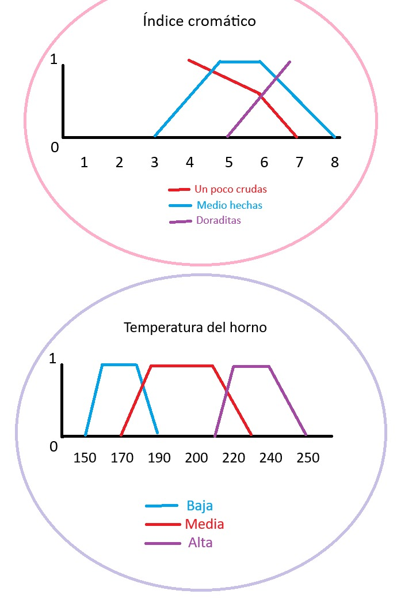

# Grandma María’s Cookies Exercise

## (Fuzzy control of an oven using an expert system implemented in CLIPS)

### Students
- Enrique Moreno Alcántara
- Carlos Cerezo López

### Files
- "bc.clp": Knowledge base containing the cookie’s fuzzy logic, the oven’s fuzzy logic, and the rules applied to it.

- "bh.clp": Fact base assuming the color index is 6.

### Output of the code:

```
FuzzyCLIPS> (load "galletas/bc.clp")
Defining deftemplate: galleta
Defining deftemplate: horno
Defining defrule: regla_1 +j
Defining defrule: regla_2 +j
Defining defrule: regla_3 +j
TRUE
FuzzyCLIPS> (load "galletas/bh.clp")
Defining deffacts: hechos
TRUE
FuzzyCLIPS> (reset)
FuzzyCLIPS> (run)
FuzzyCLIPS> (maximum-defuzzify 4)
230.0
FuzzyCLIPS> (moment-defuzzify 4)
206.25
```

### Gráfica de logica difusa de el ejercicio:

 
"
